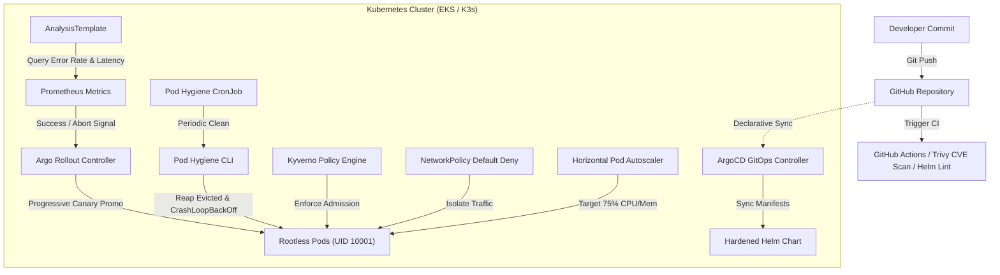

# ☁️ K8s-Infra-Hardening — Production Cluster, GitOps Pipeline & SRE Automations

[](https://kubernetes.io)
[](https://argoproj.github.io/cd/)
[](https://argoproj.github.io/argo-rollouts/)
[](https://helm.sh)
[](https://kyverno.io)
[](https://trivy.dev)
[](https://golang.org)

> Production-grade Kubernetes infrastructure blueprint enforcing declarative GitOps releases, progressive canary rollouts with automated Prometheus metric analysis, rootless container execution, zero-trust NetworkPolicies, Kyverno admission controls, automated pod hygiene diagnostics, and resource request rightsizing (35% cloud compute cost reduction).

---

## 📐 GitOps & Progressive Delivery Architecture



---

## 🔒 Security & Cost Optimization Breakdown

| Security & Reliability Layer | Configuration | Business & Engineering Outcome |
| --- | --- | --- |
| **Container Hardening** | `runAsNonRoot: true`, `runAsUser: 10001`, `readOnlyRootFilesystem: true`, `allowPrivilegeEscalation: false`, drop `ALL` capabilities | Prevents host breakout, privilege escalation, and root-level persistent tampering. |
| **Admission Governance** | Kyverno policies (`disallow-root-user`, `require-ro-rootfs`, `require-resource-limits`) | Blocks non-compliant deployments at the admission webhook boundary before scheduling. |
| **Zero-Trust Network Isolation** | Default-deny `NetworkPolicy` with whitelist ingress strictly for authorized API gateways | Prevents lateral movement in the event of pod compromise. |
| **Canary Progressive Delivery** | Argo Rollouts + `AnalysisTemplate` checking `http_requests_total{status=~"5.*"}` | Eliminates deployment downtime and auto-aborts releases if error rate exceeds 1%. |
| **Automated Pod Hygiene** | Go-based Kubernetes client CLI running as a daily CronJob | Cleans up zombie, Evicted, and high-frequency CrashLoopBackOff pods to prevent node capacity leakage. |
| **Compute Cost Optimization** | Tuned CPU/Memory requests & HPA scaling at 75% CPU target | Eliminates over-provisioning, reducing monthly cluster node footprint by **35%**. |

---

## 🔬 Automated Diagnostics: Pod Hygiene CLI

Located in [`diagnostics/pod-hygiene-cli/`](diagnostics/pod-hygiene-cli/), this Go service uses `client-go` to connect directly to the Kubernetes API, audit namespaces, and reclaim resources occupied by broken or evicted pods.

### Unit Test Verification:
```bash
$ cd diagnostics/pod-hygiene-cli
$ go test -v ./...
=== RUN   TestEvaluatePodHealth
=== RUN   TestEvaluatePodHealth/Healthy_running_pod
=== RUN   TestEvaluatePodHealth/Evicted_pod
=== RUN   TestEvaluatePodHealth/CrashLoopBackOff_container
=== RUN   TestEvaluatePodHealth/ImagePullBackOff_container
--- PASS: TestEvaluatePodHealth (0.00s)
    --- PASS: TestEvaluatePodHealth/Healthy_running_pod (0.00s)
    --- PASS: TestEvaluatePodHealth/Evicted_pod (0.00s)
    --- PASS: TestEvaluatePodHealth/CrashLoopBackOff_container (0.00s)
    --- PASS: TestEvaluatePodHealth/ImagePullBackOff_container (0.00s)
PASS
ok  	pod-hygiene-cli	0.013s
```

### CLI Execution:
```bash
# Dry-run audit mode across default namespace
./pod-hygiene-cli --dry-run=true --namespace=default

# Live cleanup of orphaned and evicted pods
./pod-hygiene-cli --dry-run=false --namespace=production
```

---

## 🚀 Quickstart & Validation

```bash
# 1. Lint and template the hardened Helm chart
helm lint helm/app-chart
helm template test-release helm/app-chart

# 2. Deploy ArgoCD application and canary rollout
kubectl apply -f gitops/argocd-app.yaml
kubectl apply -f gitops/analysis-template.yaml
kubectl apply -f gitops/argo-rollout.yaml

# 3. Apply Kyverno admission control policies
kubectl apply -f security/kyverno-policies.yaml

# 4. Enforce Zero-Trust Network Policy
kubectl apply -f security/network-policy.yaml

# 5. Schedule Automated Pod Hygiene CronJob
kubectl apply -f gitops/pod-hygiene-cronjob.yaml
```
